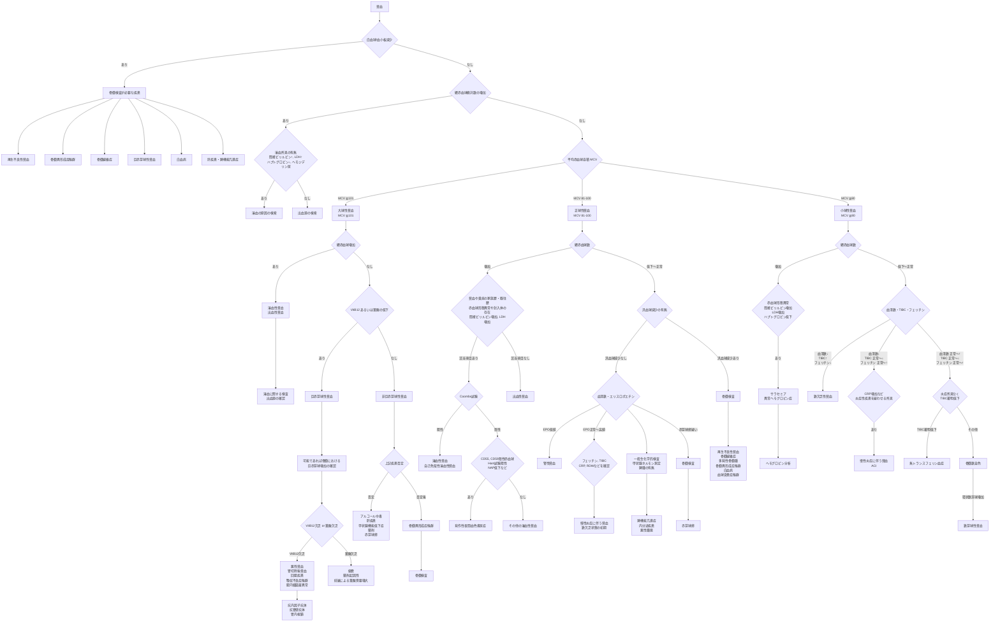

# 貧血の鑑別診断フローチャート（統合版）

出典: 成田美和子「貧血の分類と診断の進め方」日内会誌 104:1375-1382, 2015

図1（一般検査で見分ける貧血）〜 図4（正球性貧血の診断）を統合したフローチャート

---

```mermaid
flowchart TD
    %% 図1: 一般検査で見分ける貧血
    A[貧血] --> B{白血球/血小板減少}
    B -->|あり| C[骨髄検査が必要な疾患]
    C --> C1[再生不良性貧血]
    C --> C2[骨髄異形成症候群]
    C --> C3[骨髄線維症]
    C --> C4[巨赤芽球性貧血]
    C --> C5[白血病]
    C --> C6[肝疾患・脾機能亢進症]

    B -->|なし| D{網赤血球絶対数の増加}
    D -->|あり| E{溶血所見の有無<br/>間接ビリルビン↑, LDH↑<br/>ハプトグロビン↓, ヘモジデリン尿}
    E -->|あり| F[溶血の原因の検索]
    E -->|なし| G[出血源の検索]

    D -->|なし| H{平均赤血球容積 MCV}
    H -->|MCV ≧101| I[大球性貧血<br/>MCV ≧101]
    H -->|MCV 81-100| J[正球性貧血<br/>MCV 81-100]
    H -->|MCV ≦80| K[小球性貧血<br/>MCV ≦80]

    %% 図3: 大球性貧血の診断（Iから続く）
    I --> L1{網赤血球増加}
    L1 -->|あり| L2[溶血性貧血<br/>出血性貧血]
    L2 --> L3[溶血に関する検査<br/>出血源の確認]
    L1 -->|なし| L4{VitB12 あるいは葉酸の低下}
    L4 -->|あり| L5[巨赤芽球性貧血]
    L5 --> L6[可能であれば骨髄における<br/>巨赤芽球増加の確認]
    L6 --> L7{VitB12欠乏 or 葉酸欠乏}
    L7 -->|VitB12欠乏| L8[悪性貧血<br/>胃切除後貧血<br/>回腸疾患<br/>吸収不良症候群<br/>腸内細菌叢異常]
    L8 --> L9[抗内因子抗体<br/>抗胃壁抗体<br/>胃内視鏡]
    L7 -->|葉酸欠乏| L10[偏食<br/>薬剤起因性<br/>妊娠による葉酸需要増大]
    L4 -->|なし| L11[非巨赤芽球性貧血]
    L11 --> L12{上記疾患否定}
    L12 -->|否定| L13[アルコール中毒<br/>肝疾患<br/>甲状腺機能低下症<br/>薬剤<br/>赤芽球癆]
    L12 -->|否定後| L14[骨髄異形成症候群]
    L14 --> L15[骨髄検査]

    %% 図4: 正球性貧血の診断（Jから続く）
    J --> N1{網赤血球数}
    N1 -->|増加| N2{貧血や黄疸の家族歴・既往歴<br/>赤血球形態異常や封入体の存在<br/>間接ビリルビン増加, LDH増加}
    N2 -->|該当項目あり| N3{Coombs試験}
    N3 -->|陽性| N4[溶血性貧血<br/>自己免疫性溶血性貧血]
    N3 -->|陰性| N5{CD55, CD59陰性赤血球<br/>Ham試験陽性<br/>NAP低下など}
    N5 -->|あり| N6[発作性夜間血色素尿症]
    N5 -->|なし| N7[その他の溶血性貧血]
    N2 -->|該当項目なし| N8[出血性貧血]
    N1 -->|低下〜正常| N9{汎血球減少の有無}
    N9 -->|汎血球減少なし| N10{血清鉄・エリスロポエチン}
    N10 -->|EPO低値| N11[腎性貧血]
    N10 -->|EPO正常〜高値| N12{フェリチン, TIBC<br/>CRP, RDWなどを確認}
    N12 --> N13[慢性炎症に伴う貧血<br/>鉄欠乏状態の初期]
    N10 --> N14[一般生化学的検査<br/>甲状腺ホルモン測定<br/>脾腫の有無]
    N14 --> N15[脾機能亢進症<br/>内分泌疾患<br/>悪性腫瘍]
    N10 -->|赤芽球癆疑い| N16[骨髄検査]
    N16 --> N17[赤芽球癆]
    N9 -->|汎血球減少あり| N18[骨髄検査]
    N18 --> N19[再生不良性貧血<br/>骨髄線維症<br/>多発性骨髄腫<br/>骨髄異形成症候群<br/>白血病<br/>血球貪食症候群]

    %% 図2: 小球性貧血の診断（Kから続く）
    K --> S1{網赤血球数}
    S1 -->|増加| S2{赤血球形態異常<br/>間接ビリルビン増加<br/>LDH増加<br/>ハプトグロビン低下}
    S2 -->|あり| S3[サラセミア<br/>異常ヘモグロビン症]
    S3 --> S4[ヘモグロビン分析]
    S1 -->|低下〜正常| S5{血清鉄・TIBC・フェリチン}
    S5 -->|血清鉄↓<br/>TIBC↑<br/>フェリチン↓| S6[鉄欠乏性貧血]
    S5 -->|血清鉄↓<br/>TIBC 正常〜↓<br/>フェリチン 正常〜↑| S7{CRP増加など<br/>炎症性疾患を疑わせる所見}
    S7 -->|あり| S8[慢性炎症に伴う貧血<br/>ACI]
    S5 -->|血清鉄 正常〜↑<br/>TIBC 正常〜↓<br/>フェリチン 正常〜↑| S9{炎症所見なく<br/>TIBC著明低下}
    S9 -->|TIBC著明低下| S10[無トランスフェリン血症]
    S9 -->|その他| S11[骨髄鉄染色]
    S11 -->|環状鉄芽球増加| S12[鉄芽球性貧血]
```
